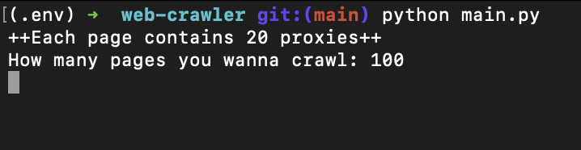
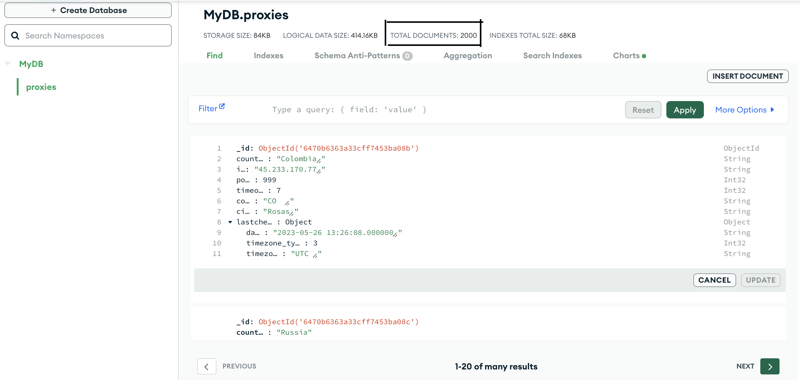

## proxydocker-crawler

a crawler for proxydocker.com

### Definition

This crawler find and grab latest proxies from proxydocker.com website
with proxies informations contains ip, port, country, code, lastCheck and ...
finnaly commit them in a Mongo Data Base.

### Usage:

1. create a virtual environment

`$ python -m venv .env` 

2. activate virtual environment

`source .env/bin/activate`

3. install requirements.txt

`$ python -m pip install -r requirements.txt`

4. You need a **mongo-db server**. create it and replace database info with yours.

5. you need environment-variable (MONGODB_PASS)

`export MONGODB_PASS='YOURPASSWORD'`

6. open proxydocker.com and from network part find your **token**, cause the token could expired.

### Running sample:

when you run main.py file.

it will ask how many pages you want to crawl

you have to enter a valid integer(1, 2, 3, ..., 100)

# executing program:

depends on how many pages you ask to crawl, it will take some times.

# Final Results will saved in MongoDB

after program executed completely, your data will save in a Database called **MyDB** and in a Collection named **proxies**.

